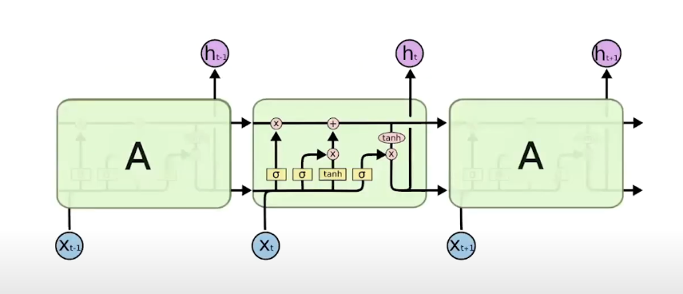

Summary

Recurrent networks capture long-term dependencies in time series data, but face stability issues. LSTMs improve memory retention through gate mechanisms.

1. Importance of Recurrence: Recurrence structures are essential for time series analysis, enabling networks to learn from sequential data effectively. This is imp in applications like natural language processing and financial forecasting.
1. Stability Challenges: The stability of recurrent networks is influenced by the eigenvalues of the weight matrix, with linear activations preserving information, while nonlinear activations forgetting inputs which undershots or overshots.
1. Activation Function Impact: Sigmoid activations quickly forget inputs, while tanh functions provide better memory retention. Linear activation function is best suited for rnn.
1. Eigenvalue Significance: An ideal weight matrix should have all eigenvalues equal to one, so that that inputs are retained. This shows the importance of weight initialization and training.
1. Memory Behavior: The exponential nature of memory behavior can lead to either explosive growth or vanishing outputs, posing challenges in training and application of recurrent networks.
1. LSTM: LSTMs mitigate the limitations of traditional RNNs by introducing gates that control memory retention. LSTMs by incorporating memory cells and gates, allowing them to selectively remember or forget information based on context.

