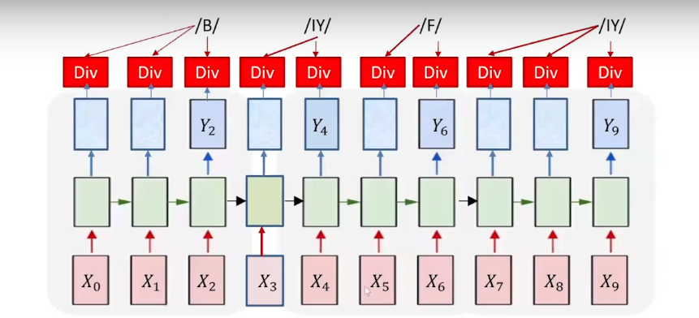

Summary

Challenges in training recurrent neural networks without strict time alignment, proposing iterative alignment strategies.

1. Training Challenges: Recurrent neural networks face challenges in modeling sequences without strict temporal alignment, therefore there is the need for new training methods.
1. Alignment: Alignment helps establish connections between input sequences and outputs, by converting it to time sycnhronous alingment by repeating the symbols.

1. VB Decoding Algorithm: VB decoding algorithm uses a methodical approach to alignment, using probability tables. Seq to Seq model networks which output symbols irregularly can decoded by vb algorithm by assuming the symbol is the output each time and then merges the adjacent symbols.
1. Path Selection: The algorithm’s selects the best path through a graph to sum expected losses across multiple alignments provides a view of all potential outcomes while masking off the unwanted and gives a target symbol sequences of the path from top left corner to the bottom right corner of the prob table.

