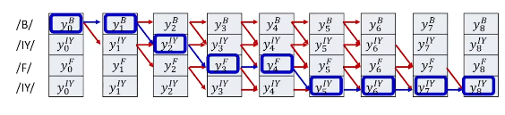
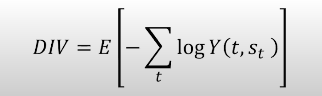
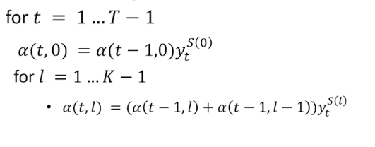
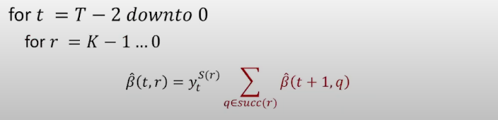

Summary

Cross-entropy loss and training CTC (Connectionist Temporal Classification) sequence models without alignment, focusing on computing loss through all possible alignments using a graph-based approach.

1. Cross-Entropy Loss: Cross-entropy loss is imp in training sequence-to-sequence models, enabling the assessment of model performance against expected outcomes.
1. Alignment-Free Training: To train models without explicit alignment, allowing for more complex sequence relationships to be modeled without rigid constraints.
1. Graph: The algorithm’s selects the best path through a graph to sum expected losses across multiple alignments provides a view of all potential outcomes while masking off the unwanted and gives a target symbol sequences of the path from top left corner to the bottom right corner of the prob table.

1. Averaging: Averaging over all alignments instead of selecting the most likely alignment use the statistical expectation over all possible alignment and this will mitigate the issue of suboptimal selection of alignment.
 
1. 
- Forward Probabilty: 
alpa(t, r) is the total probabilty of the sub graph.

- Backward Probabilty: 
beta(t, r) is the total probabilty of the exposed graph.

6. Blank Symbol: To manage repetitions and variable-length sequences we use a blank symbol, at the end of symbol completion so that it allows separation of same symbols in the sequence thus preventing compression into one symbol.

Steps
1. Step 1: Setup and intialize parameters of a network typically LSTMs (including blank symbol).
2. Step 2: Forward Pass, pass the training instance through the network and obtain all the symbol probabilties at each time.
3. Step 3: Construct a graph representing the specific symbol sequence in the instance.
4. Step 4: Perform the forward and backward algorithm to get the alpha(t, r) and beta(t, r) at each time, for each row of the nodes.
5. Step 5: Compute the derivative of divergence for each Yt. Backpropagate and aggregate derivatives over each mini-batches and update parameters.
