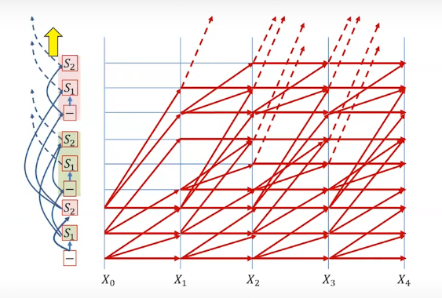
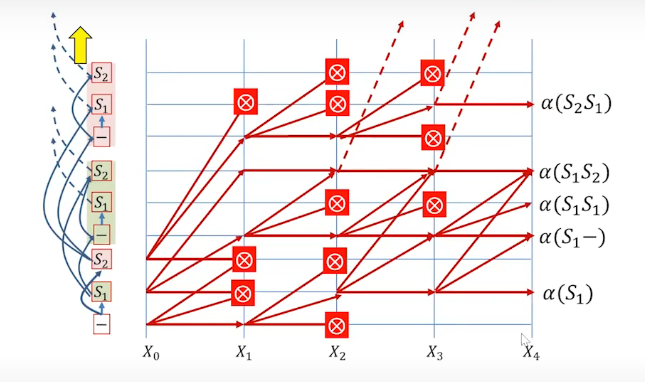

Summary

Decoding using CTC(Connectionist Temporal Classification), use of blank symbols in recurrent networks for repetitions.

1. Blank Symbol: To manage repetitions and variable-length sequences we use a blank symbol, at the end of symbol completion so that it allows separation of same symbols in the sequence thus preventing compression into one symbol.
1. Alignment: Maintaining correct alignment between input and output sequences ensures that symbol repetitions are properly distinguished.
1. Forward-Backward Algorithm: This algorithm is essential for calculating alignments in sequence data, by both forward and backward passes to probability estimations.
1.  Graph Representation: Visualizing sequences as graphs helps in understanding the relationships between symbols, including invisible blanks, which aid in deriving probabilities for sequences.
1. Decoding Approaches: Greedy decoding may yield suboptimal results as it chooses the topmost symbol limiting the options for future genrations, while beam search explores multiple sequences by retaining top K symbol probability expanding future sequence.

1.  Beam Search: By limiting the number of sequences considered at each step by exploring multiple sequences by retaining top K symbol probability expanding future sequence..
