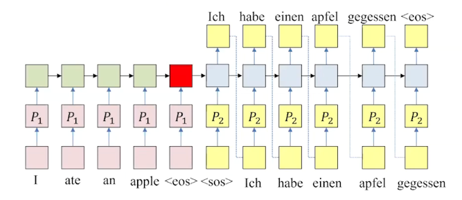
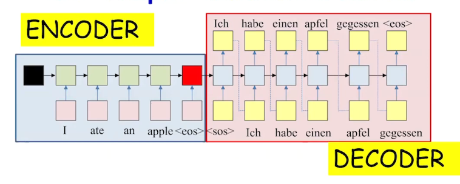

Summary

Sequence-to-sequence models using recurrent neural networks, language modeling, embedding, and the encoder-decoder architecture.

1. Limitations of One-Hot Vectors: They create high-dimensional, sparse representations that do not capture relationships between words, emphasizing the need for embeddings.
1. Training Language Models: Model predicts the next word in a sequence, by understanding of language structure and context.

1. Encoder-Decoder Framework: This model structure effectively translates input sequences into output sequences.

- Encoder: It is recurrent structure that extracts the hidden representation from the input sequence.
- Decoder: It is recurrent structure that utilizes the representation to produce output sequence.
1. Greedy vs. Beam Search: Greedy decoding may yield suboptimal results as it chooses the topmost symbol limiting the options for future genrations, while beam search explores multiple sequences by retaining top K symbol probability expanding future sequence.