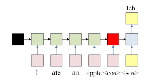
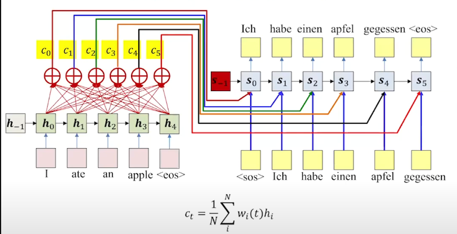
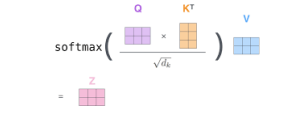
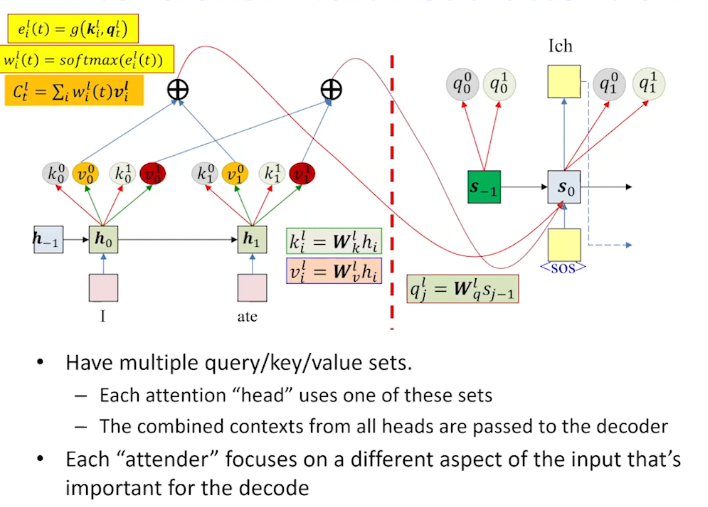

Summary

Sequence-to-sequence models with attention convert one sequence to another, using attention mechanisms to capture the context of the sequence using Query, Key and Value.

1. Translation Model: The input sequences fees into a rnn (encoder) and the seq is terminated by an explicit < eos > symbol and the last seq < eos > stores all the information about the whole sequence. A second rnn (decoder) subsequently uses an intial seq < sos > to produce seq of ouputs which continues till < eos > is generated. 

1. Encoder-Decoder Structure: The encoder-decoder architecture, where the encoder creates a compact hidden representation that the decoder uses. This emphasizes the importance of effective information compression and transfer. Decoder creates generation of ouput from the information encapulsed by the encoder.
1. Attention Mechanism: By computing attention weights- the average weighted sum of each output, the model prioritizes different input segments, which mitigates the loss of information in single vector which was generated at the end.
- Key vectors are transformed versions of embeddings that serve to encode tokens for comparison.
- Query vectors are transformed versions of embeddings that represent what each token is currently looking for.
- Value vectors hold the actual information to be aggregated and passed on as the output of the attention mechanism. 

4. Self-Attention:  This allows a model to look at every single word and relate that to other words in the sentence and allows the model to understand a word in the context of the words around it.
- Encoder ouputs an explicit "key" and "value" at each input time. Key is used to evalute the importanceof the input at that time, for a fiven output.
- Decoder outputs an explicit "query" at each output time. Query is used to evalute which inputs to pay attention to.
- The actual context is calculated by weighted sum of value. 

5. Positional Encoding: Positional encodings encodes the order of words, which is imp for model where word position is, as then we can remove the rnn from the input and directly add the positional encoding to the word embedding.
6. Multi head Attention: We can implement this whole process of calculating attention weights / heads from query, key value parallelly for single token and by doing this the model can capture various aspects of the token's relationships with other tokens in the sequence and we can combine context from all the heads into a single vector that is rich amd more informative.
- Transform the token's embedding into query, key, and value vectors separately for each of the h heads.
- Compute attention scores and the resulting weighted sum of value vectors for each head independently.
- Concatenate the outputs from all heads and apply a final linear transformation to obtain the multi-head attention output.
