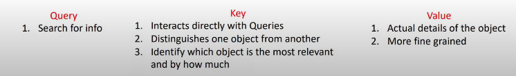
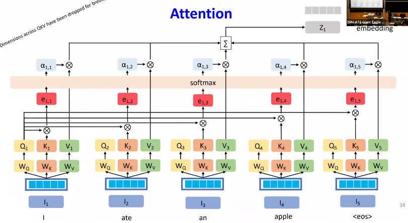
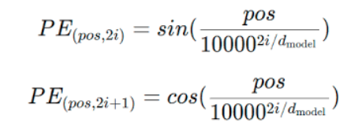

Summary

Significance of Attention, Transformer architecture, and impact of large language models on NLP.

Transformer Architecture:

1. Self-attention: It allows a model to look at every single word and relate that to other words in the sentence and allows the model to understand a word in the context of the words around it.
 
To calculate attention weight of any input we use query vector of that input and all the key vector of the input sequence, this then is scaled using softmax for numerical stability and then each product multiplied to every value of sequence and summed to give the attention weight of each individual input.

1. Parallelism: The key advantage of transformer model over rnn and lstm is that this whole attention can be calculated of every input parallelly instead finding weights and output at each time step in rnn and lstm thereby increasing the efficiency in much lesser time.
1. Positional Encoding: Positional encodings encodes the order of words. We can add positional encoding for the dimension of the model by using a periodic sin and cosine function and each iter of the dimension.

1. Multi-head Attention: We can implement this whole process of calculating attention weights / heads from query, key value parallelly for single token and by doing this the model can capture various aspects of the token's relationships with other tokens in the sequence and we can combine context from all the heads into a single vector that is rich amd more informative.
1. Add & Norm: After the multi head attention we normalize the the output with mean 0 std dev 1 to stablize the network and Add the residuals to avoid vanishing gradients and to minimize the loss of information.
1. Feed-Forward Network: We pass the outputs to a ffn to introduce non-linearity and to learn more complex patterns.
1. Masked Multi-head Attention: When we generate output from decoder we dont want to look at the future token sequence because we dont want them to influence current predictions of words while computing attention so we replace the next tokens with -infinity so that when they are passed into softmax they turn into zero.
1. The encoder-decoder attention: This allows the decoder to attend to the encoder's output by taking information from the input sequence (key and value) from the encoder’s output and (query) from first masked attention which ensures encoder-decoder attention.
1. Large language models:
    1. BERT: BERT uses the encoder part of the Transformer architecture. It processes the entire input sequence simultaneously and builds context representations for each token based on whole token sequence.
    - Training:
    - Masked Language Modeling (MLM): During training, some percentage of the input tokens are randomly masked, and the model is trained to predict the masked tokens based on the surrounding context.
    - Next Sentence Prediction (NSP): BERT is also trained on classification task to predict whether a given pair of sentences appears consecutively in the original text.
    2. GPT: GPT uses the decoder part of the Transformer architecture. It processes the input in a sequential manner without looking at the future tokens, generating the next token based on the previous tokens.
    - Training: GPT is trained to predict the next word in a sequence. During training, the model is given a sequence of words and tasked with predicting the next word in the sequence, using only the words that come before it.
