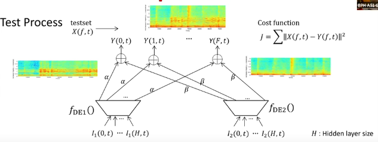

Summary

Neural networks transform data through layers, linear separability for classification, Autoencoders.

1. Layer Classification: MlP comprises of 2 componenets, A faeture extraction network that converts the inputs into linearly separable features and final linear classifier that operates on the linearly sepearale features.
1. Autoencoder: Autoencoder takes compressed representation (encoding) of input data and then reconstruct the data from this representation to learn distinct feature of representation or to remove noise.
- Encoder: Compresses input data.
- Latent Space: The compressed, lower-dimensional representation.
- Decoder: Reconstructs the original data from the latent space.

3. Manifold Learning: Autoencoders not only separate signals but also model underlying data distributions, and also gives information of the structure of complex datasets.