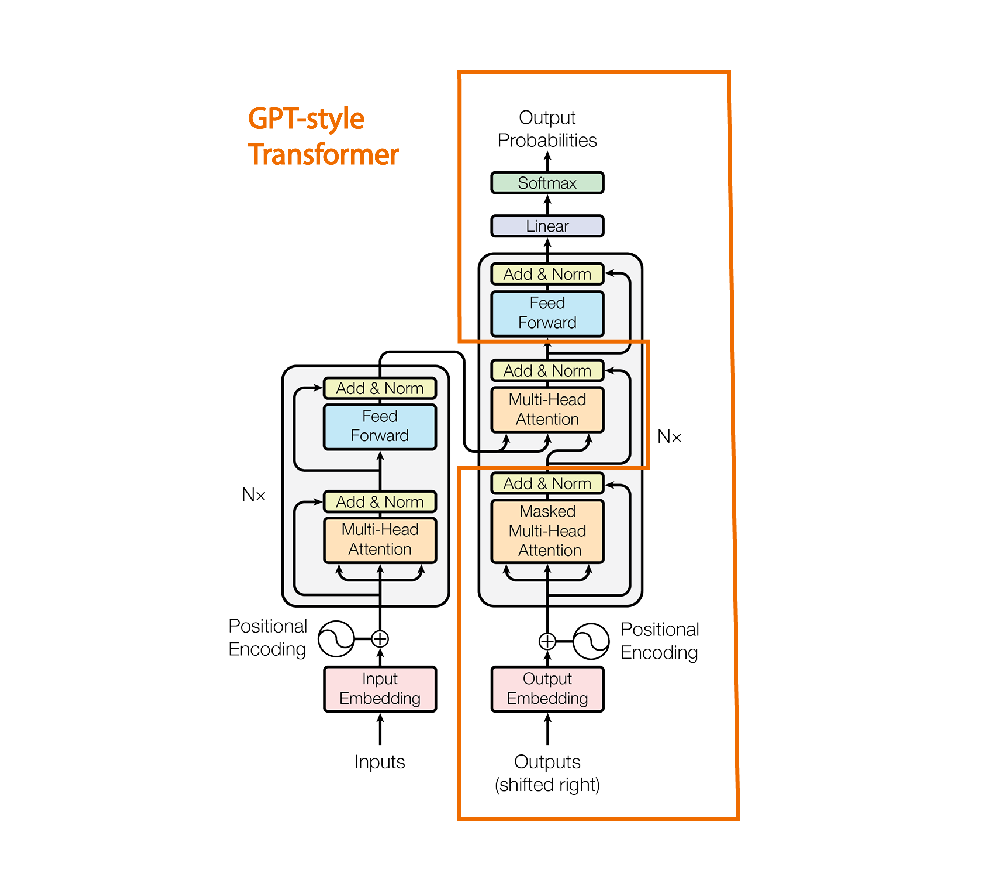
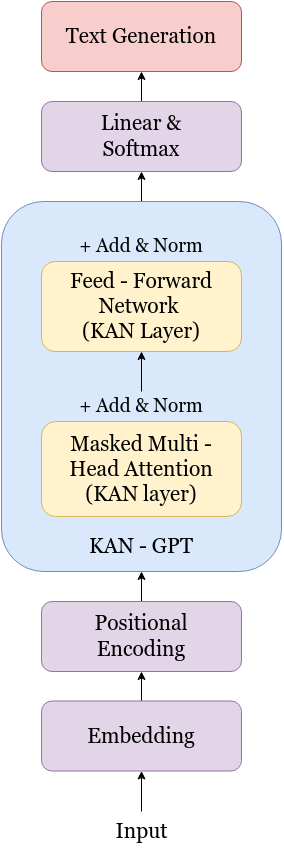
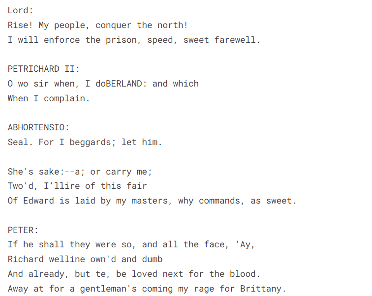

# GPT-Reimagined: KANs vs MLPs

 
## Overview

This repository contains an implementation GPT using MLPs as well as KANs along with other mini-projects. 

GPTs are a class of machine learning models known for their ability to generate natural language text and perform various natural language processing tasks.

# About the Project

## Objectives

- Implement GPT using the traditional MLP approach.
- Implement GPT using Kolmogorov-Arnold Networks (KANs).
- Compare the performance of GPT implemented with MLPs and KANs across various metrics, including but not limited to:
  - Language generation quality
  - Training speed
  - Model size
  - Resource utilization
- Provide a proof of principle for the performances of MLP-based GPTs versus KAN-based GPTs.

## Description
In this project, we aim to explore the effectiveness of Kolmogorov-Arnold Networks (KANs) as an alternative to traditional Multi Layer Perceptrons (MLPs) for implementing Generative Pretrained Transformers (GPTs). GPTs are a class of machine learning models known for their ability to generate natural language text and perform various natural language processing tasks. Traditionally, GPTs have been implemented using MLP architectures. However, KANs, a relatively new development, have shown promise in outperforming MLPs in certain tasks.

This project contributes to the ongoing research in machine learning architectures by providing empirical evidence on the efficacy of Kolmogorov-Arnold Networks as an alternative to traditional MLPs for implementing state-of-the-art language models like GPTs. The findings of this study can inform future developments in neural network architectures and guide the design of more efficient and effective models for natural language processing tasks.

## Tech Stack
- [PyTorch](https://pytorch.org/)
- [Python](https://www.python.org/)
- [Numpy](https://numpy.org/doc/#)
- [Google Collab](https://colab.research.google.com/)
- [Kaggle](https://www.kaggle.com/)
- [TikToken](https://github.com/openai/tiktoken)

## Projects we worked on
- GPT using MLP
- GPT using KAN
## Other mini-projects
- Neural Network based on MNIST dataset
  - Using MLP
  - Using KAN
- Fashion classifier using CNN
- NameGPT
- Masked Language Model using encoder
- Language translation model using transformers

## Model architectures
### MLP architecture:

### KAN-GPT architecture

    

## Generated Results
GPT (KAN):\

# File Directory

<pre><code>
gpt-reimagined/
│
├── __pycache/
│   └── config.cpython-312.pyc
│
├── data/
│   └── tinyshakespeare/
│       ├── input.txt
│       ├── train.bin
│       └── val.bin
│
├── archive_logs/
├── logs/
├── models/
├── kan.py
├── model.py
├── train.py
├── utils.py
├── dataset_shakespeare.py
├── config.py
├── generate.py
├── main.py
├── requirements.txt
└── README.md
 
</code></pre>
# Contributors
- [Kavya Rambhia](https://github.com/kavya-r30)
- [Abhay Upadhyay](https://github.com/urabhay10)

# Acknowledgement and Resources
- Andrej Karpathy https://www.youtube.com/playlist?list=PLAqhIrjkxbuWI23v9cThsA9GvCAUhRvKZ 
- CMU Deep Learning lectures https://www.youtube.com/playlist?list=PLp-0K3kfddPzMmSaoGy5SqQsqhUeMC1ay
- Research Paper-Attention Is All You Need https://arxiv.org/abs/1706.03762
- Research Paper-Kolmogorov Arnold Networks https://arxiv.org/pdf/2404.19756
- Special thanks to our mentors [Param Thakkar](https://github.com/ParamThakkar123) and [Mayank Palan](https://github.com/MayankPalan2004/)