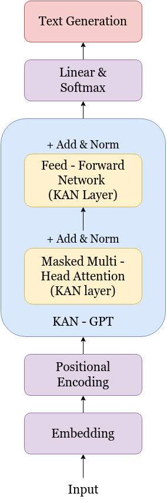

# GPT-Reimagined: KANs vs MLPs

This repository, GPT Reimagined: KANs vs MLPs, contains an implementation of a __Generative Pre-trained Transformer (GPT)__ model. The focus is to compare the performance and effectiveness of traditional __multilayer perceptron (MLP)__ layers and __Kolmogorov-Arnold Networks (KANs)__ in the architecture. 

__KANs__ are mathematical constructs based on the Kolmogorov-Arnold representation theorem, which suggests that any multivariable continuous function can be represented by a composition of univariate functions and summation. This unique approach can enable alternative network structures, potentially improving efficiency, expressiveness, or convergence rates for certain tasks.

## Table of Contents
- [Project Overview](#project-overview)
- [Installation](#installation)
- [Usage](#usage)
- [Experiment Details](#experiment-details)
- [Results](#results)
- [Directory Structure](#file-directory)
- [Contributors](#contributors)
- [Acknowledgement & Resources](#acknowledgement-and-Resources)

# Project Overview

## Description
In this project, we aim to explore the effectiveness of Kolmogorov-Arnold Networks (KANs) as an alternative to traditional Multi Layer Perceptrons (MLPs) for implementing Generative Pretrained Transformers (GPTs). GPTs are a class of machine learning models known for their ability to generate natural language text and perform various natural language processing tasks. Traditionally, GPTs have been implemented using MLP architectures. However, KANs, a relatively new development, have shown promise in outperforming MLPs in certain tasks.

This project contributes to the ongoing research in machine learning architectures by providing empirical evidence on the efficacy of Kolmogorov-Arnold Networks as an alternative to traditional MLPs for implementing state-of-the-art language models like GPTs. The findings of this study can inform future developments in neural network architectures and guide the design of more efficient and effective models for natural language processing tasks.

## Model: KAN-GPT architecture
<div align="center">
    
</div>

## Tech Stack

| **Category**                | **Technologies**                                                                                       |
|-----------------------------|----------------------------------------------------------------------------------------------------|
| **Programming Languages**   | [](https://www.python.org/)              |
| **Frameworks**              | [](https://pytorch.org/) |
| **Libraries**               | [](https://scipy.org/) [](https://pandas.pydata.org/) [](https://numpy.org/) [](https://tqdm.github.io/) [](https://github.com/openai/tiktoken) |
| **Datasets**                | [](https://www.kaggle.com/datasets/harvardnlp/tiny-shakespeare) [](https://huggingface.co/datasets/wikitext) |
| **Tools**                   | [](https://git-scm.com/) [](https://colab.research.google.com/) [](https://www.kaggle.com/) |
| **Visualization & Analysis**| [](https://matplotlib.org/) [](https://www.tensorflow.org/tensorboard) |

## Objectives

- Implement GPT using the traditional MLP approach.
- Implement GPT using Kolmogorov-Arnold Networks (KANs).
- Compare the performance of GPT implemented with MLPs and KANs across various metrics, including but not limited to:
  - Language generation quality
  - Training speed
  - Model size
  - Resource utilization
- Provide a proof of principle for the performances of MLP-based GPTs versus KAN-based GPTs.

## Other mini-projects
- Neural Network based on MNIST dataset
  - Using MLP
  - Using KAN
- Fashion classifier using CNN
- NameGPT
- Masked Language Model using encoder
- Language translation model using transformers

# Installation

1. Clone the Repository: 
    ```bash
    git clone https://github.com/your-username/GPT-Reimagined.git
    cd GPT-Reimagined
    ```
2. Download the Tiny Shakespeare or WikiText-2 Dataset: This is handled in dataset_shakespeare.py, which automatically downloads and tokenizes the dataset if it's not present.

# Usage

1. Training the Model: Run the main script to train the models.
    ```bash
    python main.py 
    ```
    - Training details, including training and validation loss, are logged and saved for analysis in TensorBoard.

2. Generating Text: After training, you can generate text using the trained model:
    ```bash
    python generate.py
    ```
    - his will generate text based on a provided input prompt.
    - Customize generate.py with desired configurations such as max_new_tokens to control the length of generated text.

# Experiment Details

The goal is to evaluate the comparative performance between KANs and MLPs when used in transformer models. Key experimental configurations:

- **Block Size:** 64 (number of tokens processed in a single pass)
- **Batch Size:** 64
- **Learning Rate:** 2e-5
- **Training Epochs:** 6 ~ ( 9435 * 6 steps)
- **Loss Function:** Cross-entropy for next-token prediction
- **Evaluation Metric:** Validation loss and perplexity

## Logging and Model Saving

- Training progress is logged to TensorBoard.
- Model checkpoints are saved in the `models/` directory.

# Results

- **Text Generation Quality:** Generated text samples from both models reveal the qualitative differences in coherence and fluency in similar number of epochs and hyper-parameter.

## Generated Results (KANs)


# File Directory

<pre><code>
GPT-Reimagined/
├── data/                          # Dataset (tiny Shakespeare data used here)
│   ├── tinyshakespeare/
│   │   ├── input.txt
│   │   ├── train.bin              # Encoded training data
│   │   ├── val.bin                # Encoded validation data
├── models/                        # Directory for saving trained models
├── logs/                          # Training logs for TensorBoard
├── archive_logs/                  # Archive of zipped logs
├── main.py                        # Main script to initiate training
├── dataset_shakespeare.py         # Data processing and loading script
├── model_kan.py                   # Kolmogorov-Arnold Network (KAN) model
├── model_mlp.py                   # MLP-based GPT model
├── train.py                       # Training loop for the models
├── config.py                      # Configuration for hyperparameters and paths
├── generate.py                    # Script for generating text with the trained model
├── utils.py                       # Utility functions
├── requirements.txt               # Required dependencies
└── README.md                      # This README file
</code></pre>

# Contributors
- [Kavya Rambhia](https://github.com/kavya-r30)
- [Abhay Upadhyay](https://github.com/urabhay10)

# Acknowledgement and Resources
- Andrej Karpathy https://www.youtube.com/playlist?list=PLAqhIrjkxbuWI23v9cThsA9GvCAUhRvKZ 
- CMU Deep Learning lectures https://www.youtube.com/playlist?list=PLp-0K3kfddPzMmSaoGy5SqQsqhUeMC1ay
- Research Paper-Attention Is All You Need https://arxiv.org/abs/1706.03762
- Research Paper-Kolmogorov Arnold Networks https://arxiv.org/pdf/2404.19756
- Special thanks to our mentors [Param Thakkar](https://github.com/ParamThakkar123) and [Mayank Palan](https://github.com/MayankPalan2004/)